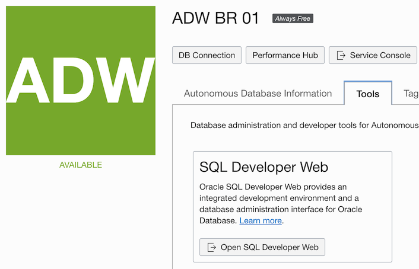

## Part 1 - Logging into Oracle Cloud & SQL Developer Web

We will login to Oracle Cloud to use our Autnomous Data Warehouse (ADW) created previously for the current activity. If you have not setup your Oracle Cloud account or your ADW database please refer to the documentation [here](https://bradyjrothrock.github.io/Oracle-Cloud-Free-Tier-Education-Setup/).

## Signing into Oracle Cloud 

Sign in using the following login method:
- Go to [www.oracle.com](www.oracle.com)
- Click on Menu Item > View Accounts

Click on Sign-in to Cloud (Figure 1).

At this point consider bookmarking this screen (Oracle Cloud Sign-on).

<figure>
    
    <figcaption style="text-align:center;">Figure 1<figcaption>
</figure>

Enter your Account Name (Figure 2).

If you forgot your Account Name it's in your registration email as **Cloud Account**.

<figure>
    
    <figcaption style="text-align:center;">Figure 2<figcaption>
</figure>

Click Next.

Now enter in your email address and password used to create the account (Figure 3).

<figure>
    
    <figcaption style="text-align:center;">Figure 3<figcaption>
</figure>

You should now see the Your Oracle Cloud Main Home Page

<figure>
    
    <figcaption style="text-align:center;">Figure 4<figcaption>
</figure>

Notice you should have money available in your trial credits and Trial Days should be more than 30.

<figure>
    
    <figcaption style="text-align:center;">Figure 5<figcaption>
</figure>

Note: If you happen to see that you only have 30 days of Trial then you did not actually create the account using the proper education email address. Contact your Instructor Immediately. 

You will need to create a new cloud account using the email account that Oracle Academy contacted you with.

*Hint: You can bookmark this page and it will go directly to the prompt without having to go to oracle.com again.*

## Launching Autonomous Data Warehouse

Once signed in to your Cloud account, you can locate your database by using the hamburger icon in the top left corner and selecting Autonomous Data Warehouse.

<figure>
    
    <figcaption style="text-align:center;">Figure 6<figcaption>
</figure>

This will bring you to your database page where you can select your live database created previously.

<figure>
    
    <figcaption style="text-align:center;">Figure 8<figcaption>
</figure>

Select the database to show the various options we have. If the database is **Stopped** click on **More Actions** to select **Start**. This may take a minute or two to start back up. 

<figure>
    
    <figcaption style="text-align:center;">Figure 9<figcaption>
</figure>

Now click on the **Tools** tab and select **Open SQL Developer Web**.

<figure>
    
    <figcaption style="text-align:center;">Figure 10<figcaption>
</figure>

This will present you with the login screen in Figure 11. Login using the **ADMIN** credentials you created when establishing this database.

<figure>
    
    <figcaption style="text-align:center;">Figure 11<figcaption>
</figure>