## Part 2 - SQL Basics

We wills start by covering most of the basics necessary to navigate SQL from a querying perspective.

## What's a Schema?

To work with data in an Oracle SQL database we first need to ensure we understand what a Schema is. 

>A schema is a collection of logical structures of data, or schema objects. A schema is owned by a database user and has the same name as that user. Each user owns a single schema. Schema objects can be created and manipulated with SQL. ([docs.oracle.com](https://docs.oracle.com/cd/B19306_01/server.102/b14220/schema.htm#:~:text=A%20schema%20is%20a%20collection,Clusters))

What this means for us, is that the data we will access is going to be stored either in a different Schema where data was loaded, or we will load our own data into the **ADMIN** Schema.

For the purposes of this activity we will be using the Schema **SH**.

## Finding Schema Tables

When connecting to a new Oracle Schema there are two approaches we could use to see what tables are available in the Schema.

### Option 1

On the left-hand side of the page under the **Navigator** tab you will see the username you logged in with as **ADMIN**. Select the dropdown to locate and select the **SH** Schema.

<figure>
    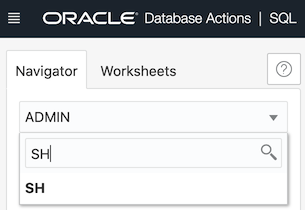
    <figcaption style="text-align:center;">Figure 1<figcaption>
</figure>

You will now be presented with a list of available tables on the left-hand side.

<figure>
    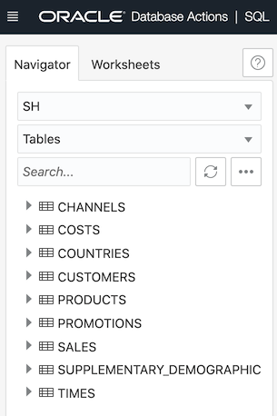
    <figcaption style="text-align:center;">Figure 2<figcaption>
</figure>

### Option 2

Our second option is to discover the available tables with code. Copy and paste the following block of code into the Query Worksheet and click the green **Play Button**.

```SQL
-- What tables are in our schema 'SH'?
SELECT *
FROM ALL_TABLES
WHERE OWNER = 'SH';
```

<figure>
    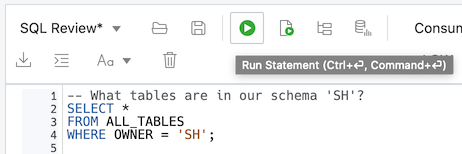
    <figcaption style="text-align:center;">Figure 2<figcaption>
</figure>

Our first line with two dashes (--) is what we call a comment. These are important to document what our code is doing without impacting the execution the code. More on this later.

To list our avialable tables the `SELECT *` tells SQL to return all columns from our query. We are selected data `FROM ALL_TABLES` where Oracle stores information on every avaiable table. Then finally we select `WHERE OWNER = 'SH'` as a condition to only return tables listed under the **SH** Schema. In Oracle `OWNER` is the keyword referring to Shema and our conditional `WHERE` clause allows us to return only records meeting our criteria.

You should see the same tables listed in the **Query Result** pane at the bottom of your page along with more meta data about each table.

<figure>
    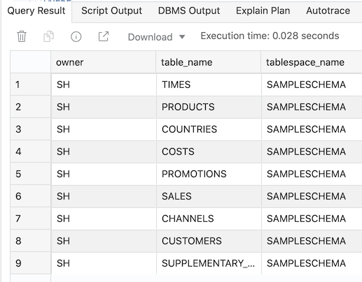
    <figcaption style="text-align:center;">Figure 3<figcaption>
</figure>

## Exploring Tables

When we want to know more about a table of data there 3 options depending on the level of detail and if we are looking for meta data or actual records.

### Option 1

Similar to our first option locating the tables in our Schema using the **Navigator** tab, we can also click the dropdown arrow next to any table to see the fields contained within.

<figure>
    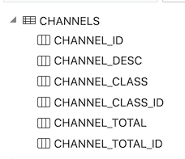
    <figcaption style="text-align:center;">Figure 4.1<figcaption>
</figure>

### Option 2

Our second and third options will use SQL code to explore the table. We can create **Script Output** describing the fields in our table by using the following simple query. Copy, paste, and run the following block of code.

```SQL
-- Find out more about a specific table
DESCRIBE SH.CHANNELS
```

<figure>
    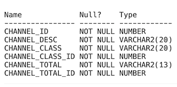
    <figcaption style="text-align:center;">Figure 4.2<figcaption>
</figure>

Describe is a command in SQL that provides table of data including the column names, if they cann be blank (NULL), and the data type. This can be a helpful way to determine both the available columns and data types for comparrison with other tables of interest. Notice how when we reference our table name it follows the pattern **`<Schema>.<Table>`**. Although, in some cases specifying the Schema is not required, it is best practice to always include the Schema to avoid any issues and remove ambiguity. We will use this pattern all throughout this activity.

### Option 3

Our third option is to write a simple **SELECT** statement to query the tables and visually explore the first subset of records. Copy, paste, and run the following block of code.

```SQL
-- Selecting the data
SELECT *
FROM SH.CHANNELS;
```

This will return the following table in Figure 5 that will allow us to visually inspect our table recoreds. Notice how we have a semicolon (;) at the end of every SQL statement. This is not only good practice, but also helps SQLDeveloper know what code to execute based on the location fo the cursor without need to highlight the full block of code.

<figure>
    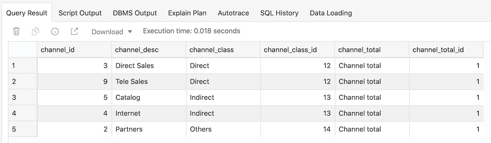
    <figcaption style="text-align:center;">Figure 5<figcaption>
</figure>

The `SELECT *` portion of the code again returns all avialable columns `FROM SH.CHANNELS` table. SQL will return up to the first 100 rows initially for review. 

## Querying the Data

Now that we have a better idea of our data stored within our Schema we can now selectively query the data we need for our analysis.

Let's start by retrieving a subset of columns from the **SH.COUNTRIES** table. Copy, paste, and run the following block of code.

```SQL
-- Retrieve just columns we want
SELECT
    COUNTRY_ID,
    COUNTRY_ISO_CODE,
    COUNTRY_NAME
FROM
    SH.COUNTRIES;
```

Before the review the results of this query you will notice that we have visually formatted the code so that it is easier to read. SQL Developer does not read *whitespace* and continues until it finds key pieces of information to determine how to execute the given code. I've formatted the code this way by using the **tab** key, but you can also let SQL Developer do this for you as well usings the **Format** tool in the tool bar shown in Figure 6. However beware, if you write complex queies the **Format** tool might change your code format into a less useful form. To change your code back you can undo with **Ctrl + z** or **Cmd + z**. 

<figure>
    
    <figcaption style="text-align:center;">Figure 6<figcaption>
</figure>

From the query you should see the results in Figure 7 below. Notice how I can only see the first 12 records for the 3 columns I selected, but if I scroll I can see the full table. You will also notice at the bottom it reports the query returned **23 rows total**. If there had been more than 100 rows returned by the query it would state that it is showing the first 100 rows. We'll cover next easy ways to check how many rows there are. 

<figure>
    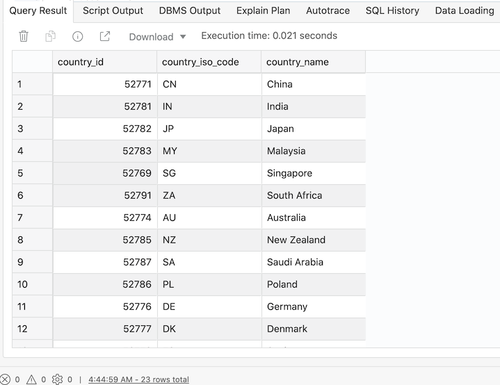
    <figcaption style="text-align:center;">Figure 7<figcaption>
</figure>

## Conditional Querying and Wildcards

When we want to query data based upon specific conditions there are a multitude of optoins. We will cover here the most common and the basics on how to use them. 

### WHERE AND

All of our basic conditional statements fall within the **WHERE** portion of our query. After specifying the location of the data we are querying we use the keyword **WHERE** followed by our first conditional statement. If we have any subsequent conditional statements we can add those with as many **AND** keywords as necessary. See the example below. Copy, paste, and run the following block of code.

```SQL
-- Retrieve data based on conditions
SELECT
    COUNTRY_ID,
    COUNTRY_ISO_CODE,
    COUNTRY_NAME
FROM
    SH.COUNTRIES
WHERE
	COUNTRY_ISO_CODE = 'US'
    AND COUNTRY_NAME = 'United States of America';
```

This code demonstrates two conditional statements, although we only needed to use one to return the result. As you can see in Figure 8, the query returns the record(s) matching our exact criteria. 

<figure>
    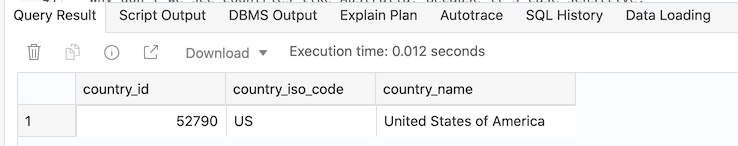
    <figcaption style="text-align:center;">Figure 8<figcaption>
</figure>

But what if our criteria wasn't exact and needed to match a patter?

### LIKE

If we want to specify a condition that follows a pattern, the easiest way to do this is to use the **LIKE** command. With this command we can provide a string pattern usings wildcards for SQL to return records matching the pattern. The two wildcards are the percent symbol (**%**) and underscore (**_**). The percent symbol stands for 0, 1, or many characters, whereas, the underscore represents a single character. 

See the examples below. Copy, paste, and run the following blocks of code.

Notice how each query returns multiple records that match the criteria specified. 

```SQL
-- Like with percent wildcards for string patterns
SELECT
    COUNTRY_ID,
    COUNTRY_ISO_CODE,
    COUNTRY_NAME
FROM
    SH.COUNTRIES
WHERE
	COUNTRY_NAME LIKE '%U%';
```

<figure>
    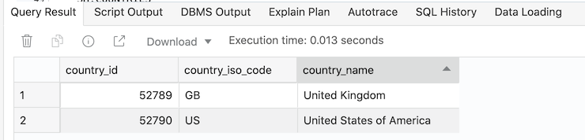
    <figcaption style="text-align:center;">Figure 9<figcaption>
</figure>

In our first statement we returned all records with an **`U`** preceeded by or followed by any number of characters. We specified this by following the **LIKE** command with the string pattern in single quotation marks ('). We can use as many wildcards in any order desired.

However, did you notice we did not return records like **Australia**. The reason is that the **LIKE** command is **case-sensitive**. This can be useful when we want to specify patterns based on case, however, if we don't want case to impact our results this is a good opportunity to use the SQL function **UPPER**. Upper will convert the field to all uppercase, allowing the **LIKE** command to locate all records with an **`U`** regardless of case.

```SQL
-- Like with percent wildcards and upper for string patterns
SELECT
    COUNTRY_ID,
    COUNTRY_ISO_CODE,
    COUNTRY_NAME
FROM
    SH.COUNTRIES
WHERE
	UPPER(COUNTRY_NAME) LIKE '%U%';
```

<figure>
    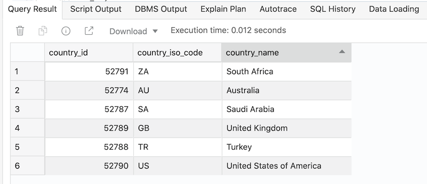
    <figcaption style="text-align:center;">Figure 10<figcaption>
</figure>

```SQL
-- Like with underscore for string patterns
SELECT
    COUNTRY_ID,
    COUNTRY_ISO_CODE,
    COUNTRY_NAME
FROM
    SH.COUNTRIES
WHERE
	COUNTRY_ID LIKE '527_1';
```

<figure>
    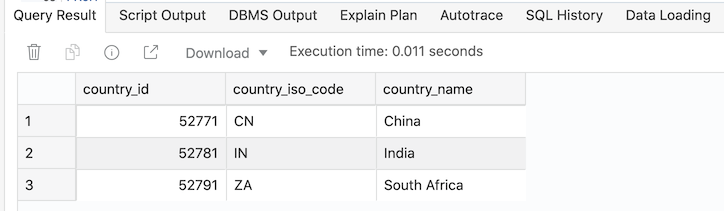
    <figcaption style="text-align:center;">Figure 11<figcaption>
</figure>

In our second statement using an **underscore** we returned all records beginning with **`527`**, followed by any number or character, and finished with **`1`**. We specified this by following the same approach as before. Again, we can use as many wildcards in any order desired.

### IN

Another handy command to return records that match a specific value or values, is the **IN** command. You can proivide the **IN** command with a list of values and it will reutrn all records that match the provided list. See the example below. Copy, paste, and run the following block of code.

```SQL
-- Retrieve records in a list
SELECT
    COUNTRY_ID,
    COUNTRY_ISO_CODE,
    COUNTRY_NAME
FROM
    SH.COUNTRIES
WHERE
	COUNTRY_ISO_CODE IN ('US', 'GB');
```

<figure>
    
    <figcaption style="text-align:center;">Figure 12<figcaption>
</figure>

The list proivded to the **IN** command should be contained within parenthesis and each item should be within single quotation marks. In the future we will discuss how to use a **Subquery** to create a list but for now we will work with hard coded lists. 

### NOT

Lastly, you might be looking for only records that don't meet a specific condition or aren't in a list. The may be easier than specifying multiple different patterns to exculde the one you don't want.

The easiest way to accomplish this is by usings the **NOT** command. Placing **NOT** before your conditional statement or other commands such as **LIKE** and **IN** will return the inverse of the conditional statements. See the example below. Copy, paste, and run the following block of code.

```SQL
-- Retrieve records in a list
SELECT
    COUNTRY_ID,
    COUNTRY_ISO_CODE,
    COUNTRY_NAME
FROM
    SH.COUNTRIES
WHERE
	COUNTRY_ISO_CODE NOT IN ('US', 'GB');
```

<figure>
    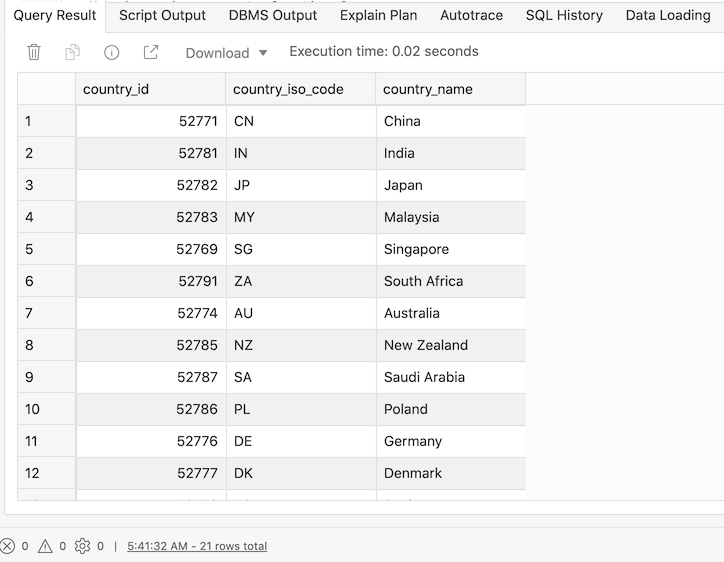
    <figcaption style="text-align:center;">Figure 13<figcaption>
</figure>

Notice how the 21 records returned includes all countries except `United Kingdom` & `United States of America`.

## Counting Records

Sometimes it is necessary to know how many records are in a table or meet a specific criteria. We'll cover the fastest way to accomplish both.

If you want to know how many records are in a table you will want to specify in your select statement **`SELECT COUNT(*)`**. This means you want to count all records. You can see this by copy, paste, and runing the following block of code.

```SQL
-- Selecting the data
SELECT COUNT(*) AS "COUNT"
FROM SH.COUNTRIES;
```

You should see the very simple result below in Figure 14. Also, notice that we added **AS "COUNT"**. This is referred to as **Aliasing** which in laymens terms means we are renaming the object. We will use this concept continuously, as well as, later on when dealing with **Joins**.

<figure>
    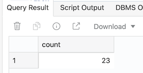
    <figcaption style="text-align:center;">Figure 14<figcaption>
</figure>

If you want to count the number of records that match a specified conditional statement, you simply need to provide a **WHERE** clause. 

## Aggregating Records

We can perform aggregate function on our measures, and some dimensions, to perform different types of analyses. The simplest form is to calculate an aggregation for a whole dataset based on a specific field. Copy, paste, and runing the following block of code.

```SQL
-- Summing our Quantity Sold
SELECT
    SUM(QUANTITY_SOLD) AS "Sum of Quantity Sold"
FROM
    SH.SALES;
```

<figure>
    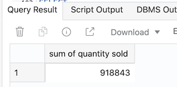
    <figcaption style="text-align:center;">Figure 15<figcaption>
</figure>

Here you see that we calculated the **sum of quantity sold** to be **918,843** units. We also used aliasing to ensure the returned column name was descriptive. 

However, what if we want to include dimensions and calculate values at each unique dimension? To do this we will introduce the concept of **GROUP BY** command. To use **GROUP BY** we need to proivde a list of all dimension fields that are not be aggregated. Copy, paste, and runing the following block of code.

```SQL
-- Summing our Quantity Sold by Product ID
SELECT
    PROD_ID,
    SUM(QUANTITY_SOLD) AS "Sum of Quantity Sold"
FROM
    SH.SALES
GROUP BY
    PROD_ID;
```

<figure>
    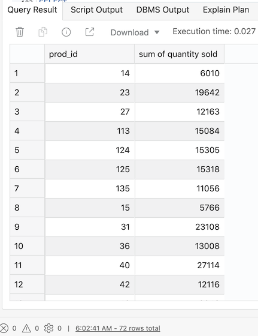
    <figcaption style="text-align:center;">Figure 16<figcaption>
</figure>

If we desire to have more dimensions we need only to proivde them to **GROUP BY** separated by commas such as below.

```SQL
-- Summing our Quantity Sold by Product ID by Channel ID
SELECT
    PROD_ID,
    CHANNEL_ID,
    SUM(QUANTITY_SOLD) AS "Sum of Quantity Sold"
FROM
    SH.SALES
GROUP BY
    PROD_ID, CHANNEL_ID;
```

<figure>
    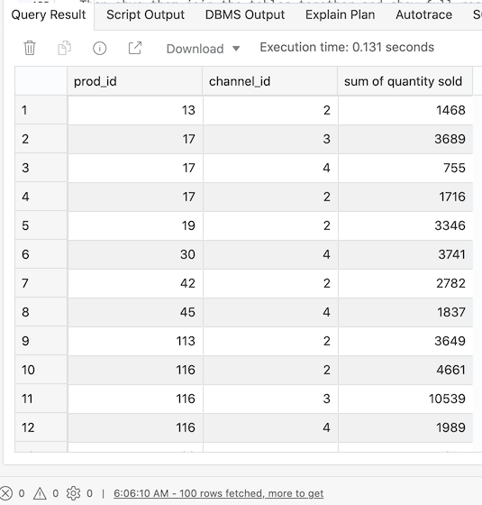
    <figcaption style="text-align:center;">Figure 17<figcaption>
</figure>

## Joining Data

Very often we need to get data from multiple tables to answer our questions. This is due to the Star or Snowflake schema appraoched applied in most relational databses. To join our data together based on a common field there are two ways.

### WHERE Clause

Using the **WHERE** clause to join two tables together can be simplistic, but offers limited flexability. To use this method we will specify multiple tables in our **FROM** statement separate by commas. We will also usings **aliasing** to reduce the amount needed to be written in our code. We will using the **alias** names for the tables to also specify which table each field came from. Although this isn't requried, if the tables have a similar field name you will receive an error regarding ambiguity. In these instances it is also best to alias the columns as well. Copy, paste, and runing the following block of code.

```SQL
-- Selected data from multiple tables
SELECT
    S.TIME_ID,
    S.QUANTITY_SOLD,
    C.CUST_GENDER,
    C.CUST_LAST_NAME
FROM
    SH.SALES S, SH.CUSTOMERS C
WHERE
	S.CUST_ID = C.CUST_ID;
```

<figure>
    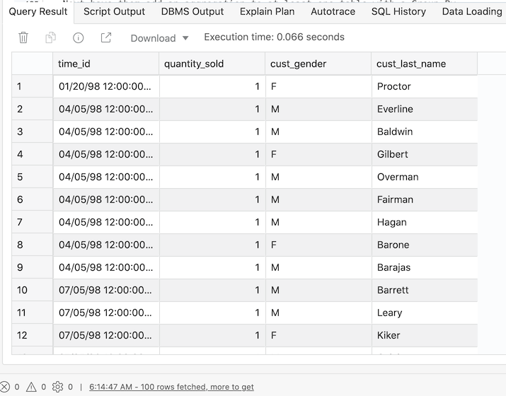
    <figcaption style="text-align:center;">Figure 18<figcaption>
</figure>

Notice how I aliased the tables as **S** & **C**. This was as an abbreviation of the table name making it easier to read the code. As you can see the **Time** and **Quantity** fields came from **SALES** and the **Customer Gender** and **Customer Last Name** came from the **CUSTOMERS** table. We joined the two tables on records where the **CUST_ID** in both tables matched. We can specify any field names here that should be joined on, regardless if they are the same name.

### JOIN Command

Now we can join the same datasets based on the same criteria using the **JOIN** command. This will differ from the previous approach by defining each subsequent table with the command **JOIN**. After specifying the table name, with an alias, we then use the **ON** command to provide the condidition similar to the **WHERE** clause. We will talk about the more advanced capability fo **JOIN** at a later time. Copy, paste, and runing the following block of code.

```SQL
-- Selected data from multiple tables
SELECT
    S.TIME_ID,
    S.QUANTITY_SOLD,
    C.CUST_GENDER,
    C.CUST_LAST_NAME
FROM
    SH.SALES S
    JOIN SH.CUSTOMERS C ON (S.CUST_ID = C.CUST_ID);
```

<figure>
    
    <figcaption style="text-align:center;">Figure 19<figcaption>
</figure>

Notice how this provides the exact same results as using our **WHERE** clause. 