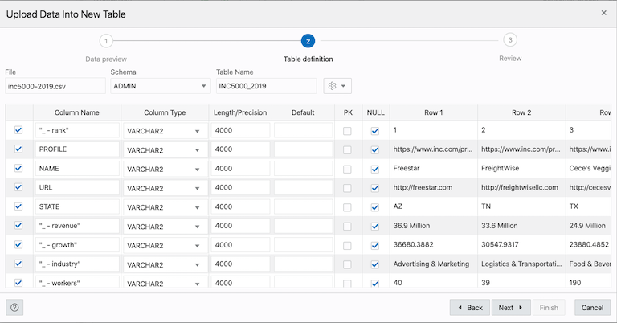
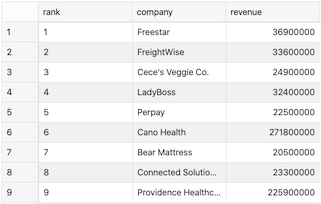

## Part 3 - Loading and Cleaning Data

Here we will talk about how to load data into our Autonomous Data Warehouse (ADW) database and how to use SQL functions to "clean" the data as we peform different fucntions. You are welcome to do your cleaning in whatever tool you feel most comfortable, but for the purposes of this activity we are going to load our data into SQL Developer and use SQL to perform transformation on the fly.

## Data Loading

SQL Developer makes this a very easy process to load external files through a graphical user interface (GUI) wizard.

Prior to loading our **Inc.com** datasets we cleaned up all of our headers in Excel or a text editor. 

To load data into our database we'll use the Web import from file feature in the **Data Loading** tab.

The file formats that you can upload are CSV, XLS, XLSX, TSV and TXT.

To upload data from local files to an new table with SQL Developer Web, do the following:

1. Click on the **Data Loading** 

2. If this is your first upload you will see a pane allowing you to **Drag and drop** your file or **Select files**. Once you've performed your first upload you will need to click on the **Upload Data** icon designated by a cloud with an up arrow. Select or drag and drop the file you would like to upload. 

<figure>
    
    <figcaption style="text-align:center;">Figure 1<figcaption>
</figure>

3. At this point you can configure import details in the **Data Preview** and once configured click **Next**.

<figure>
    
    <figcaption style="text-align:center;">Figure 2<figcaption>
</figure>

4. You will now be presented with the **Table definition** page. Here you will specify the **Schema** where the table should be stored and the **Table Name**. You will also specify/update data types, new column names, and other parameters. For now we will just update any necessary column names and data types the nclick **Next**.

**Original:**

<figure>
    
    <figcaption style="text-align:center;">Figure 3<figcaption>
</figure>

**Updated:**

<figure>
    
    <figcaption style="text-align:center;">Figure 4<figcaption>
</figure>

5. You will now be presented with a preview of the column mapping. If there is a problem at this stage, information shows with more details, such as pending actions. This would typically mean you need to correct or fix the source file data before you import.

<figure>
    
    <figcaption style="text-align:center;">Figure 5<figcaption>
</figure>

6. Click **Finish** and the data will loaded. 

<figure>
    
    <figcaption style="text-align:center;">Figure 6<figcaption>
</figure>

*Depending on the size of the data file you are importing, the import may take some time.*

SQL Developer Web provides a history to show the status of the import and to allow you to review the results or errors associated with the import operation.

For a detailed summary of the upload process, right-click the table in the Navigator tab, select Data loading, and then select Loaded Data. A summary of the data loaded is displayed in the Loaded data summary dialog.

If any data failed to load, you can view the number of rows in the Failed Rows column. Click the column and a dialog is displayed showing the failed rows.

In the Loaded data summary dialog, you can also search for files loaded by schema name, table name, or file name. To remove the loaded files, click the Delete icon.

## Data Cleaning

For this portion we will analyze the **Inc 5000** file that we just loaded and is used for our homework assignment.

With our **Inc5000** data loaded we will want to query and analyze the dataset. However, to do this there are some fields that are of the inccorect type. In particular we are going to focus on the **Revenue** field for this part of the activity.

When we have a column of data that should be numerical but is imported as a string we need to consider why the field was treated as a string to start.

In the case of our **Revenue** column the data includes a dollar sign ($) as well as a word specifying the scale (e.g. millions). To clean a column such as this to perform aggregate analyses on it we need to breakdown the conversions needed into steps.

<figure>
    
    <figcaption style="text-align:center;">Figure 7<figcaption>
</figure>

Pay close attention to the use of parenthesis '()' when we apply and nest different functions, as it is easy to miss one and the error codes are not always helpful in determining the true cause of the error.

### Removing Unecessary Characters

When we have a string field in SQL and would like to remove some character(s) we will use the **REPLACE** function. Help documenation on the **REPLACE** function can be found [here](https://docs.oracle.com/cd/B19306_01/server.102/b14200/functions134.htm).

The **REPLACE** function has two required arguments and one optional. They are the followiong:

1. String that need to be changed (Required)

2. The *search_string* that we would like to replace (Required)

3. The *replacement_string* that is put in the original strings place (Optional)

The *replacement_string* is optional becuase if not proivded **REPLACE** simply removes the *search_string*.

In our **Revenue** column the first thing we might want to remove is the dollar sign ($). To do this we can use the following. Copy, paste, and run the code.

```SQL
SELECT
	RANK,
	COMPANY,
	REPLACE(REVENUE, '$') as REVENUE
FROM 
	INC500;
```

<figure>
    
    <figcaption style="text-align:center;">Figure 8<figcaption>
</figure>

Notice how the dollar signs have been removed. Now lets do the same thing for the string **` million`**. Pay close attention to the space before the word **million** to ensure we remove the space as well. Also, we don't know if the word **million** is always lowercase, so we will use the **UPPER** function from preivously and remove the string **` MILLION`**. Copy, paste, and run the followingcode.

```SQL
SELECT
	RANK,
	NAME,
	REPLACE(REPLACE(UPPER(REVENUE), '$'), ' MILLION') as REVENUE
FROM 
	INC5000;
```

<figure>
    
    <figcaption style="text-align:center;">Figure 9<figcaption>
</figure>


Have we successfully removed all of the unecessary string characters from the **Revenue** column? 
	    
If we click on the arrow in the **Revenue** column to sort the column we quickly see that we have values with **Billion** in them as well.
	    
This is problemsome. We can add another `REPLACE()` function to remove **` BILLION`**, however, we won't be able to identify which rows need to be multiplied by **1,000,000** or **1,000,000,000**.
	    
To handle this we need what is called a **Case** statement, or as I like to refer to it **Case When Then Else End** statement.
	    
### Case Statements
	    
Case statements work similar to **IFS()** statements in Excel and **For Loops** in R & Python. 
	    
The **Case** statement aptly begins with the word **CASE**. It is then follow by **WHEN**, the condition to be checked, **THEN**, & finally the value to return if the condition is true.
	    
A new function we will use here is called **INSTR()** which stands for **In String**. The function returns the count of how many times the search string appears in the specificed field. Therefore, if we search for **'M'** the value returns **1** when the word **Million** is found and **0** for **Billion**.
	    
We then compare the resulting value to **0** similar to a where statement so that it returns **TRUE** when the count of the search string is greater than **0**. This is one of many ways to accomplish this task, but is considered the simpliest.
	    
When the condition of the **WHEN** statement resolves **TRUE** we then execute the code following **THEN** for the evaluated row. In this case we can use a single **REPLACE()** function for each **THEN** statement replacing **' MILLION"** or **' BILLION'** depending on which **WHEN** statement resolves **TRUE**.
	    
We additionally can include an **ELSE** statement to perform a function or return a value when none of the **WHEN** statements resolve **TRUE**.
	    
Finally, we identify the end of the **CASE** statement with the key word **END** and name the returned field with **AS FIELD_NAME**. If we want spaces in the field name we need to surround it in quotations.
	    
```SQL
SELECT
	RANK,
	NAME,
	CASE
        	WHEN INSTR(UPPER(REVENUE), 'M') > 0 THEN REPLACE(UPPER(REVENUE), ' MILLION')
        	WHEN INSTR(UPPER(REVENUE), 'B') > 0 THEN REPLACE(UPPER(REVENUE), ' BILLION')
        	ELSE NULL
    	END AS "CLEAN REVENUE",
	REVENUE
FROM 
	INC5000;
```

If we sort our new **Clean Revenue** column we can see that we successfully removed the word **Billion** & **Million**. However, as mentioned previously we need to multiply the resulting values by **1,000,000,000** & **1,000,000** respectively.
	    
To do this we need to convert the column to a number and perform multiplication. Fortunately we can add these steps to our **THEN** statements to perform these steps.
	    
	    
Now let's convert the column to a number we can analyze.

### Converting to a Number & Scale

To convert the **Revenue** column to a number, we need another function called **to_number()**. Documentation on the **to_number()** function can be found [here](https://docs.oracle.com/cd/E11882_01/server.112/e41084/functions211.htm). 

The **to_number()** function can utlizing specific formats, but for our purposes we will proivde only one required argument which is the field we want to convert from a string to a number, as the name implies. Because the **Revenue** column only contains numbers and a decimal we can use this function to convert it to a numbrer. Copy, paste, and run the following code.

```SQL
SELECT
	RANK,
	NAME,
	CASE
        	WHEN INSTR(UPPER(REVENUE), 'M') > 0 THEN TO_NUMBER(REPLACE(UPPER(REVENUE), ' MILLION')) 
        	WHEN INSTR(UPPER(REVENUE), 'B') > 0 THEN TO_NUMBER(REPLACE(UPPER(REVENUE), ' BILLION')) 
        	ELSE NULL
    	END AS "CLEAN REVENUE"
```
	   
<figure>
    
    <figcaption style="text-align:center;">Figure 10<figcaption>
</figure>
	    
First you should noticed the **Revenue** column is now right justified, this visually means the values are being stored as number. Now all we need to do is scale the data with multiplication to match the scale previously inlucded as text.

Performation a mathmatical calucation on a numerical field is very simply and only requires we add the expression to the column selection. Copy, paste, and run the following code to scale our data to millions & billions.
	    
```SQL
SELECT
	RANK,
	NAME,
	CASE
        	WHEN INSTR(UPPER(REVENUE), 'M') > 0 THEN (TO_NUMBER(REPLACE(UPPER(REVENUE), ' MILLION')) *1000000)
        	WHEN INSTR(UPPER(REVENUE), 'B') > 0 THEN (TO_NUMBER(REPLACE(UPPER(REVENUE), ' BILLION')) *1000000000)
        	ELSE NULL
    	END AS "CLEAN REVENUE"
```


<figure>
    
    <figcaption style="text-align:center;">Figure 11<figcaption>
</figure>

We've now successfully loaded our **Inc5000** data and cleaned the **Revenue** column dynamically in our query. As Admins we could update the source data, however, it is very common in business that you are provided data "as is" and you may not have the luxury of changing the source data or requesting a change be made. We can however create a view to hold this converion. However, this will be convered in a future lecture.  

